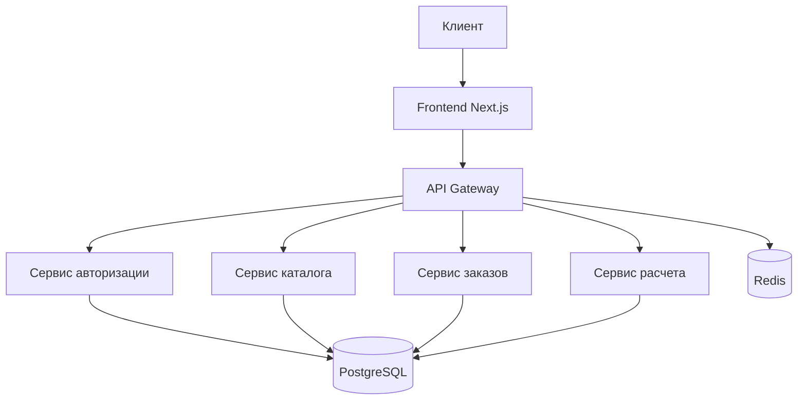

# Проект: УРАЛМЕТАЛЛОМАРКЕТ - Платформа продажи металлопроката

## Содержание
1. [Общая информация](#общая-информация)
2. [Цели проекта](#цели-проекта)
3. [Технический стек](#технический-стек)
4. [Архитектура](#архитектура)
5. [Стандарты разработки](#стандарты-разработки)
6. [Этапы разработки](#этапы-разработки)
7. [Безопасность](#безопасность)
8. [Мониторинг и логирование](#мониторинг-и-логирование)

## Общая информация
- **Название**: УРАЛМЕТАЛЛОМАРКЕТ
- **Тип**: B2B/B2C веб-платформа
- **Описание**: Онлайн-платформа для продажи металлопроката с функциями каталога, расчета стоимости и оформления заказов

## Цели проекта
1. Создание современной веб-платформы для продажи металлопроката
2. Автоматизация процессов заказа и расчета стоимости
3. Повышение качества обслуживания клиентов
4. Увеличение онлайн-продаж
5. Оптимизация внутренних бизнес-процессов

## Технический стек
### Frontend
- Next.js 14 (App Router)
- TypeScript
- Tailwind CSS
- Shadcn/ui
- Framer Motion
- React Query

### Backend
- Node.js
- PostgreSQL
- Prisma ORM
- Redis (кеширование)
- REST API

### Инфраструктура
- Docker
- Nginx
- CI/CD (GitHub Actions)
- AWS (планируется)

## Архитектура
### Общая структура

### Компоненты системы
1. **Frontend**
   - SSR для SEO и производительности
   - Оптимизация изображений
   - Progressive Web App (PWA)
   - Адаптивный дизайн

2. **Backend**
   - Микросервисная архитектура
   - REST API
   - JWT авторизация
   - Rate limiting
   - Кеширование

## Стандарты разработки
### Код-стайл
- ESLint + Prettier
- Husky для pre-commit хуков
- Conventional Commits

### Именование
- Компоненты: PascalCase
- Функции: camelCase
- Константы: UPPER_SNAKE_CASE
- Файлы компонентов: PascalCase.tsx
- Утилиты: camelCase.ts

### Документация
- JSDoc для функций и компонентов
- Swagger/OpenAPI для API
- README.md в каждой директории
- Актуализация документации при изменениях

## Этапы разработки
1. **Фаза 1: MVP** (текущая)
   - Базовый каталог продукции
   - Форма заявки
   - Основные страницы
   - Базовая SEO-оптимизация

2. **Фаза 2: Основной функционал**
   - Система авторизации
   - Личный кабинет
   - Онлайн-калькулятор
   - Корзина и оформление заказа

3. **Фаза 3: Расширенный функционал**
   - Интеграция с 1С
   - Онлайн-оплата
   - CRM-система
   - Аналитика и отчеты

## Безопасность
- HTTPS
- JWT токены
- Rate limiting
- SQL-инъекции защита
- XSS защита
- CSRF токены
- Валидация данных
- Логирование действий

## Мониторинг и логирование
- Sentry для отслеживания ошибок
- Google Analytics
- Яндекс.Метрика
- ELK Stack для логов
- Prometheus + Grafana для метрик

---
*Последнее обновление: 2024-03-19* 